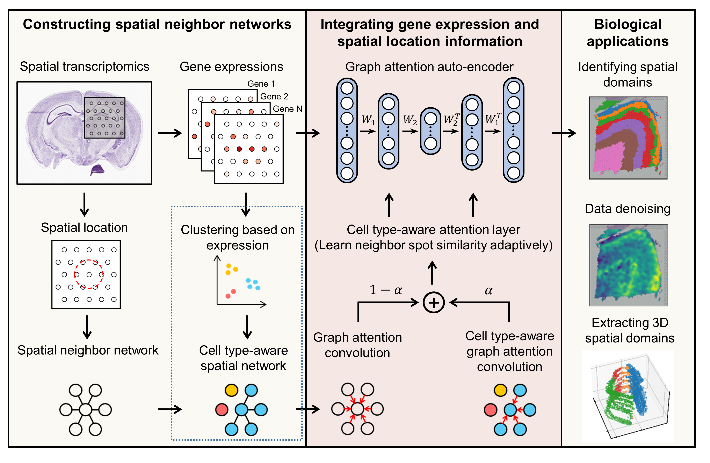

.. StaGATE documentation master file, created by
   sphinx-quickstart on Thu Sep 16 19:43:51 2021.
   You can adapt this file completely to your liking, but it should at least
   contain the root `toctree` directive.

STAGATE – deciphering spatial domains from spatially resolved transcriptomics
=============================================================================

.. toctree::
   :maxdepth: 1

   Installation
   T1_DLPFC
   T2_MouseBrain
   T3_Slide-seqV2
   T4_Stereo
   T5_3D
   T6_Denoising

STAGATE is designed for spatial clustering and denoising expressions of spatial resolved transcriptomics (ST) data. 

STAGATE learns low-dimensional latent embeddings with both spatial information and gene expressions via a graph attention auto-encoder. 
The method adopts an attention mechanism in the middle layer of the encoder and decoder, which adaptively learns the edge weights of spatial neighbor networks, and further uses them to update the spot representation by collectively aggregating information from its neighbors.
The latent embeddings and the reconstructed expression profiles can be used to downstream tasks such as spatial domain identification, visualization, spatial trajectory inference, data denoising and 3D expression domain extraction.

Citation
========
Dong, Kangning, and Shihua Zhang. "Deciphering spatial domains from spatially resolved transcriptomics with adaptive graph attention auto-encoder." bioRxiv (2021). doi: https://doi.org/10.1101/2021.08.21.457240
